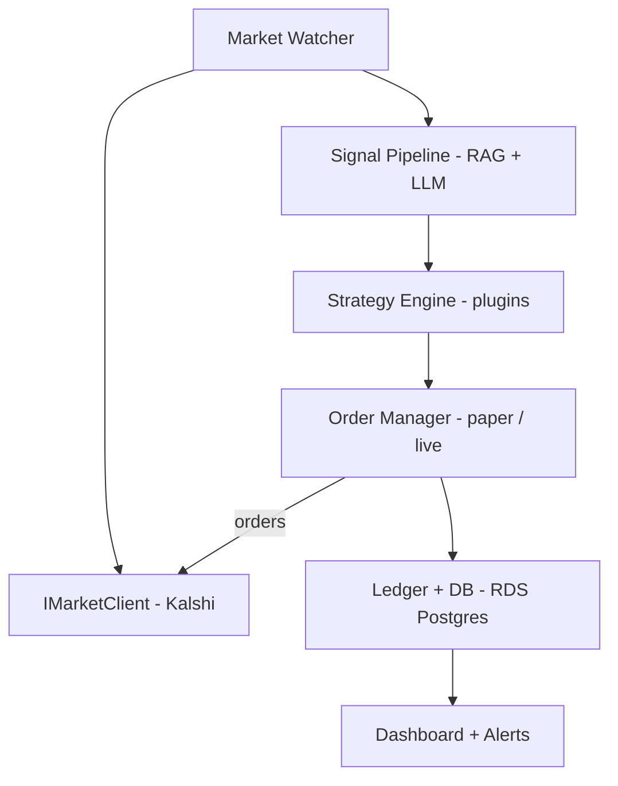
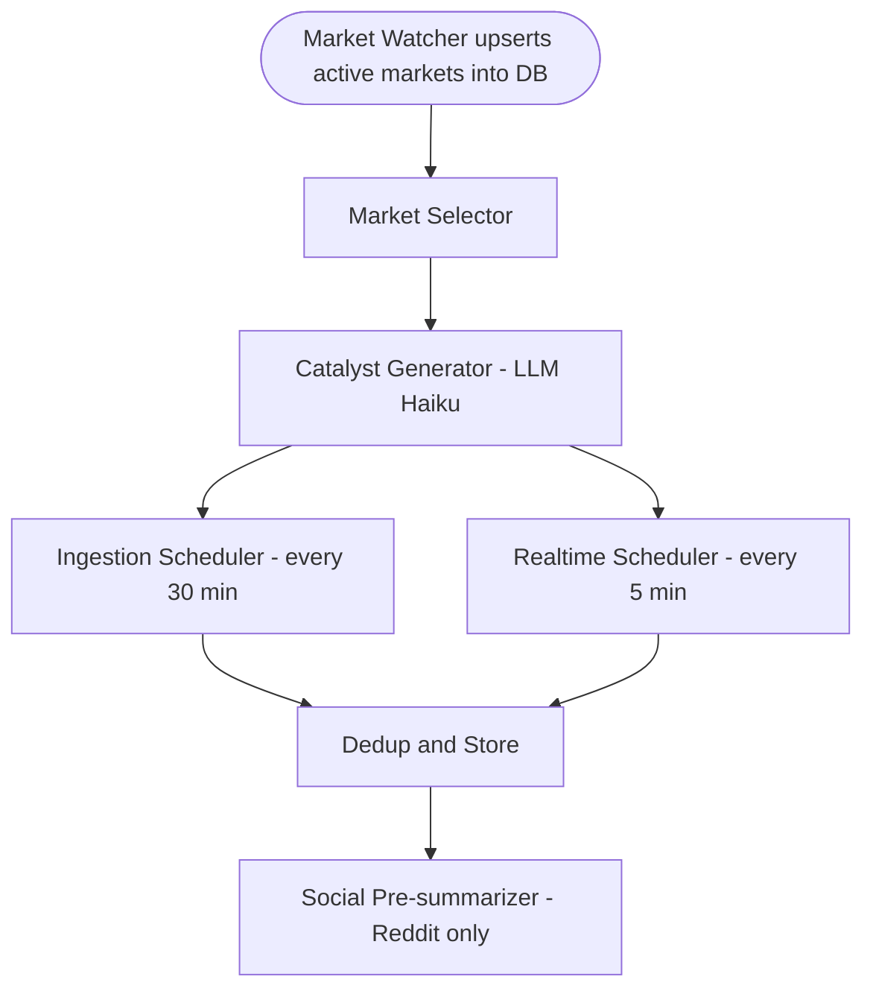
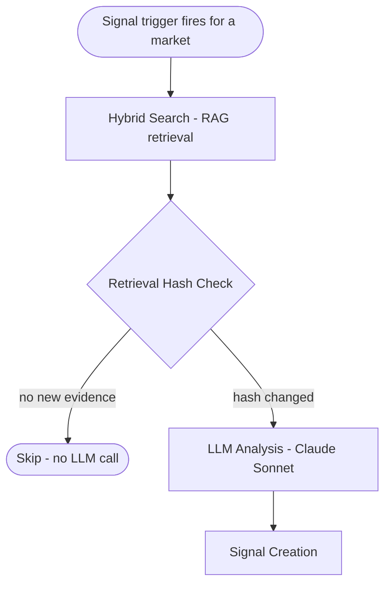
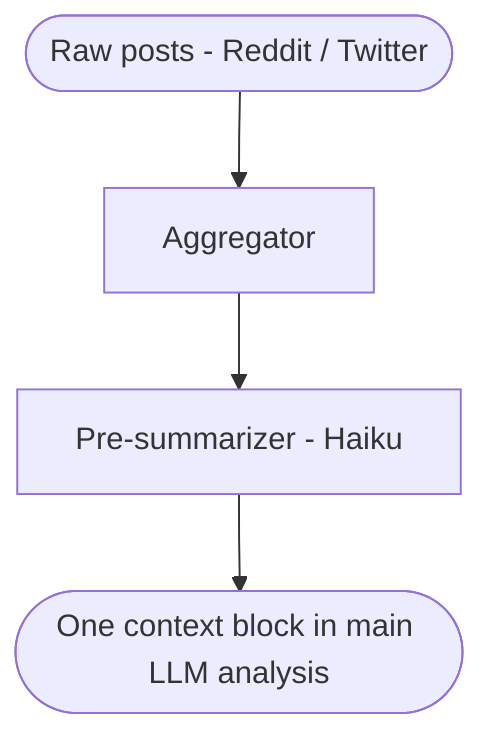

# freqpred — Project Specification

> A framework for LLM-driven prediction market trading, modeled on freqtrade's architecture.

**Version:** 0.1-draft
**Last updated:** 2026-03-27
**Status:** Phase 2 complete — paper trading running; Phase 3 (live trading) next

---

## 1. Vision

freqpred is an extensible, strategy-driven framework for trading prediction markets using LLM sentiment analysis. The core thesis: LLMs can estimate the "true" probability of future events by reasoning over current news and context. Where that estimate diverges meaningfully from a market's implied probability, there is a tradeable edge.

The framework is:
- **Personal first** — optimized for a single operator running their own strategies
- **Open source ready** — architecturally clean enough to publish and extend
- **Honest about signal quality** — paper trading and calibration tracking before live capital

freqpred is to prediction markets what [freqtrade](https://github.com/freqtrade/freqtrade) is to crypto trading.

---

## 2. Goals

- [x] Fetch active prediction markets from Kalshi and score them with an LLM signal pipeline
- [x] Implement a code-driven strategy plugin interface (`IPredictionStrategy`)
- [x] Track paper trades and measure real-world calibration over time
- [ ] Execute live trades on Kalshi with hard risk controls
- [x] Provide a web dashboard and Telegram/Discord alerts
- [ ] Run continuously on AWS as an always-on service

## 3. Non-Goals (v1)

- **No backtesting engine** — LLM training data contamination makes historical backtests unreliable; paper trading is the validation approach
- **No non-US markets** — Polymarket is geo-blocked for US users; Kalshi is the only regulated platform in scope
- **No portfolio optimization** — Kelly sizing per market is sufficient; no cross-market correlation modeling
- **No options/spreads** — Binary yes/no positions only in v1

---

## 4. Platform Scope

### v1: Kalshi (primary)
- CFTC-regulated, US-legal real-money prediction market exchange
- REST API with WebSocket for live data
- Supports market lookup, order placement, position management
- Full historical resolved market data available

### v2 (future): Interactive Brokers
- Event contracts available via IBKR API
- Adds broader market coverage without regulatory concerns
- Requires separate adapter implementation

### Architecture note
All market interactions go through an abstract `IMarketClient` interface. Kalshi is the first concrete implementation. Adding IBKR or any future platform requires only a new adapter — zero changes to strategy or signal logic.

---

## 5. Market Selection

Rather than fetching news for broad categories, freqpred focuses ingestion on the specific markets that registered strategies care about. This produces a tighter, higher-quality document store.

### Strategy-driven market selection

The `IPredictionStrategy` interface exposes an `is_market_interesting(market) → bool` method. The **Market Selector** (a component between the market watcher and the catalyst generator) queries all active markets from the DB and calls every registered strategy's `is_market_interesting()`. A market is included if *any* strategy returns `True`. Markets not selected by any strategy are excluded from catalyst generation and ingestion.

This means the ingestion pipeline adapts automatically as strategies are added, removed, or reconfigured — no separate category config list is needed.

### Default strategy focus (v1)

The bundled strategies cover:

1. **US Politics & Elections** — High news coverage, strong LLM training signal, structured event cycle (primaries, votes, appointments)
2. **Technology & Fintech** — Product launches, earnings beats, regulatory approvals, M&A deals

These categories are selected because:
- News signal is dense and temporally predictable
- LLM knowledge of the domain is deep
- Market liquidity on Kalshi is comparatively high

Other categories (macro/Fed, geopolitics, sports) are supported by the architecture but excluded from default strategy configurations in v1.

---

## 6. System Architecture



### Component Responsibilities

| Component | Responsibility |
|---|---|
| **Market Watcher** | Polls Kalshi for active markets, upserts into DB |
| **Market Selector** | Reads active markets from DB; calls `strategy.is_market_interesting()` on each registered strategy; passes selected markets to Catalyst Generator |
| **Catalyst Generator** | LLM call (Haiku) per selected market: derives 3–5 specific search queries (catalysts) representing events that could materially shift probability. Stored as first-class DB entities. Re-runs daily, RAG-informed on subsequent passes. |
| **Position Watcher** | Streams live price updates via Kalshi WebSocket for markets with open positions |
| **Ingestion Scheduler** | Reads the latest active catalyst queries per market from DB; runs Tavily + NewsAPI + Reddit + GDELT + TV Archive fetchers against those queries (every 30 min); upserts results into Document store |
| **Realtime Scheduler** | Polls cursor-based near-real-time sources on a faster cadence (default 5 min): TV chyrons via Internet Archive Third Eye API; Truth Social account feeds. Uses `fetcher_cursors` for dedup so frequent polling does not double-process. |
| **Signal Pipeline** | Retrieves news context via RAG, runs LLM analysis, returns probability estimate |
| **Strategy Engine** | Applies `IPredictionStrategy` plugins to signal output, decides trade/size/skip |
| **IMarketClient** | Abstract interface over Kalshi (and future platforms); handles orders, positions, balance |
| **Order Manager** | Executes paper or live trades; enforces hard risk caps before any order |
| **Ledger** | Immutable trade log; records every signal, position, and resolution outcome |
| **Dashboard** | Web UI for monitoring; Telegram/Discord for push alerts |

---

## 6a. Position Watcher — WebSocket Price Tracking

Markets with open positions need tighter price monitoring than the 5-minute REST poll:
- A price move of ±5 cents on a held position can materially change the exit decision.
- Resolution events (market settled, determined) need to be caught quickly so P&L can be recorded.

The **Position Watcher** maintains a persistent Kalshi WebSocket connection and subscribes to the `ticker` channel for every market where freqpred holds at least one open position (`status = "open"`).

### WebSocket channels used

| Channel | Payload | Action |
|---|---|---|
| `ticker` | Real-time best bid/ask update | Update `MarketRow` price fields + `price_updated_at`; emit `price_moved` signal trigger if Δmid ≥ threshold |
| `market_lifecycle_v2` | Global broadcast (market_ticker filter not supported). `determined` carries `settlement_value`; `settled` does not. | On `determined`: close positions at $1/$0; on `settled` with no cached result: REST fallback |

### Connection lifecycle

```
On startup / position opened:
  - Build subscription set: {market_id for position in open_positions}
  - Connect to wss://api.elections.kalshi.com/trade-api/ws/v2
  - Authenticate (same RSA-PSS headers as REST, passed in connect message)
  - Subscribe to ticker + market_lifecycle_v2 for each market in the set

While connected:
  - On ticker update: upsert price in DB; emit price_moved event if threshold crossed
  - On market_lifecycle_v2 → determined: settlement_value present ("1.0000"=YES, "0.0000"=NO) → resolve position, record P&L, unsubscribe
  - On market_lifecycle_v2 → settled: no settlement_value → REST fallback if determined was missed
  (channel is global broadcast; market_ticker filters not supported — filter in code)

On position closed / market resolved:
  - Remove market from subscription set

On disconnect:
  - Exponential backoff reconnect (1s → 2s → 4s → … → 60s max)
  - Re-subscribe to current open-position set on reconnect
```

### Relationship to REST polling

REST polling (Market Watcher, every 5 min) continues for **all** markets regardless of whether WebSocket is active. This provides a fallback: if the WebSocket drops and reconnect is in progress, the REST poll ensures prices don't go stale beyond the polling interval × 3 staleness threshold.

Markets **without** open positions are REST-only. The WebSocket subscription set is strictly scoped to open positions to minimise connection overhead.

### Implementation notes

- Lives in `freqpred/markets/watcher.py` alongside the REST polling loop, as an independent async task.
- Shares the same `AsyncSession` factory and `MarketRow` upsert logic as the REST watcher.
- Auth token for the WebSocket handshake uses the same RSA-PSS signing as REST (`KalshiClient._make_auth_headers`).
- Requires `websockets` or `httpx-ws` dependency (to be added when implemented — Phase 3).
- In paper mode, the WebSocket is still useful for accurate price tracking even though no real orders are submitted.

### Kalshi ↔ DB position reconciliation

The operator may place manual trades on Kalshi outside freqpred (e.g. hedging, manual signals). Kalshi returns **net** contracts per ticker from `get_positions()` — there is no per-order breakdown, so manually-added contracts are indistinguishable from freqpred's. The reconciliation strategy accepts this:

**Triggered at startup and on WebSocket reconnect:**

| DB (open/pending live position) | Kalshi net | Action |
|---|---|---|
| `contracts = N` | `position = M`, M ≠ N | Update `PositionRow.contracts` to M and log |
| `contracts = N` | not present / 0 | Auto-close position in DB at current mid price; log warning |
| not present | `position = M` | Log info and skip — manual-only trade, no DB record to manage |

**At exit time:** the exit order is submitted for the Kalshi net position size (from the most recent reconciliation snapshot), not the DB `contracts` value. This ensures a manually-augmented position is fully closed.

**P&L note:** entry price is taken from the DB (freqpred's original entry). If the operator manually added contracts at a different price, the average entry will be slightly wrong. This is accepted — the DB is not a full order blotter, just a position tracker.

---

## 7. Core Data Models

### Market
```python
@dataclass
class Market:
    # --- Identity (never changes after creation) ---
    id: str                          # Kalshi market ID
    platform: str                    # "kalshi"
    question: str                    # "Will X happen by Y?"
    category: str                    # "politics" | "technology" | ...
    close_time: datetime             # when market resolves

    # --- Price snapshot (changes frequently) ---
    yes_bid: float                   # current best bid for YES (0.0-1.0)
    yes_ask: float                   # current best ask for YES (0.0-1.0)
    mid_price: float                 # (bid + ask) / 2
    volume_24h: float                # liquidity proxy
    open_interest: float

    # --- Cache control ---
    last_fetched_at: datetime        # last time we polled Kalshi for this market
    price_updated_at: datetime       # last time price data actually changed
    metadata_fetched_at: datetime    # last time we refreshed metadata (question, close_time, etc.)

    # --- Signal linkage ---
    current_signal_id: str | None    # FK → latest Signal for this market

    metadata: dict                   # raw platform data
```

**Cache refresh rules:**
- **Price data** (`yes_bid`, `yes_ask`, `mid_price`, `volume_24h`): refresh every polling interval (default: 5 minutes). A market watcher loop updates these fields and sets `last_fetched_at`.
- **Metadata** (question, `close_time`, category): refresh once on creation, then daily. These rarely change; `metadata_fetched_at` tracks staleness.
- **`price_updated_at`** is set only when price actually changes, not on every poll. This lets us detect when a market has gone stale (no price movement in 24h+ = potentially illiquid, flag it).
- A market is considered **stale** and skipped for signal analysis if `last_fetched_at` is older than the configured polling interval × 3.
- **Markets with open positions** bypass the polling interval and receive real-time price updates via the Kalshi WebSocket `ticker` channel (see §6a below). `last_fetched_at` and `price_updated_at` are still updated on each WebSocket tick so the DB stays current.

### Signal

**Signals are immutable and append-only.** Every re-evaluation of a market creates a new Signal record — existing signals are never updated. `Market.current_signal_id` is updated to point to the latest. This preserves the full history of how estimates evolved as evidence accumulated, which is valuable for calibration analysis (e.g., do early signals or late signals predict resolution better?).

```python
@dataclass
class Signal:
    id: str
    market_id: str                   # FK → Market

    # --- Estimate ---
    estimated_probability: float     # LLM's estimate (0.0-1.0)
    confidence: float                # LLM self-reported confidence (0.0-1.0)
    edge: float                      # direction-adjusted edge at signal time:
                                     #   YES: estimated_probability - market.mid_price
                                     #   NO:  market.mid_price - estimated_probability
                                     # (positive = we believe the contract is underpriced)
    market_mid_at_signal: float      # snapshot of market price when signal was created
    direction: str                   # "YES" | "NO" | "SKIP"

    # --- Context ---
    reasoning: str                   # LLM explanation (logged, not traded on)
    sources: list[str]               # URLs used in RAG context
    social_sentiment_summary: str | None  # pre-summarized social signal (nullable)
    retrieval_hash: str              # hash of retrieved Document IDs — same hash = no new evidence in store

    # --- Provenance ---
    model_used: str                  # e.g. "claude-sonnet-4-6"
    prompt_version: str              # e.g. "politics-v2" — for tracking prompt changes
    trigger: str                     # "scheduled" | "price_moved" | "new_evidence" | "manual"
    created_at: datetime
    raw_context: str                 # full retrieved context (for debugging)
```

**Signal refresh triggers** (any of these causes a new Signal to be created):
1. **Scheduled** — re-analyze every N hours (configurable per strategy, e.g. every 12h for markets closing in >7 days, every 2h for markets closing in <48h)
2. **Price moved** — market mid-price shifted by more than a configurable threshold (e.g. ±5 cents) since the last signal; our edge may have changed materially
3. **New evidence detected** — retrieval hash differs from the last signal's hash, meaning new articles/posts were found
4. **Manual** — operator triggers re-analysis via CLI or dashboard

**What does NOT trigger a new signal:** a scheduled poll that returns the same retrieval hash as the last signal. If nothing new was retrieved, the LLM would produce the same output — no point calling the API.

### Position
```python
@dataclass
class Position:
    id: str
    market_id: str                   # FK → Market
    signal_id: str                   # FK → Signal that triggered this position

    # --- Strategy attribution ---
    strategy_name: str               # e.g. "PoliticsEdgeStrategy"
    strategy_version: str            # e.g. "1.2.0" — for P&L attribution across versions

    # --- Signal snapshot at time of trade ---
    # These are snapshotted from the Signal at entry time because the signal
    # may be superseded by a newer one before the market resolves.
    signal_confidence: float         # confidence score that drove the trade decision
    signal_edge: float               # edge at time of trade
    signal_estimated_prob: float     # LLM probability estimate at time of trade

    # --- Order details ---
    direction: str                   # "YES" | "NO"
    contracts: int
    entry_price: float
    entry_time: datetime
    mode: str                        # "paper" | "live"

    # --- Lifecycle ---
    status: str                      # "pending" | "open" | "closed" | "cancelled"
    # pending:   order submitted, awaiting fill confirmation from Kalshi
    # open:      position filled and active
    # closed:    market resolved or manually exited
    # cancelled: order submitted but cancelled before fill

    # --- Filled after resolution ---
    exit_price: float | None
    exit_time: datetime | None
    resolution: int | None           # 1 = YES won, 0 = NO won
    pnl: float | None
    pnl_pct: float | None
```

**On snapshotting signal fields into Position:** The signal that triggered a trade may be superseded before the market resolves — a `price_moved` trigger could create a new Signal with a different estimate. Snapshotting `confidence`, `edge`, and `estimated_prob` at entry time means the Position record is a self-contained record of *why* the trade was placed, independent of subsequent re-evaluations. This is essential for honest P&L attribution: did the trades placed at high confidence actually outperform low confidence trades?

### StrategyConfig
```python
@dataclass
class StrategyConfig:
    name: str
    min_edge: float                  # minimum edge to trade (e.g. 0.15)
    min_confidence: float            # LLM confidence threshold (e.g. 0.70)
    max_exposure_per_market: float   # % of bankroll (e.g. 0.05)
    kelly_fraction: float            # fractional Kelly multiplier (e.g. 0.25)
    categories: list[str]            # which categories this strategy trades
    min_volume_24h: float            # liquidity filter
    max_days_to_close: int           # don't trade markets closing too soon/late
    min_days_to_close: int

    # --- Exit management (freqtrade-style) ---
    stoploss: float = -0.20
    # Trigger exit when position loses this fraction from entry price.
    # e.g. -0.20 = exit if unrealized loss exceeds 20%.
    # Enforced by the position monitor on every price poll — strategy cannot override.
    # All stoploss/trailing/ROI thresholds operate on the *effective contract price*:
    #   YES positions: effective_price = market.mid_price
    #   NO  positions: effective_price = 1.0 - market.mid_price
    # The position monitor converts automatically — strategy configs use the same
    # threshold values regardless of direction.

    trailing_stop: bool = False
    # If True, stoploss trails from the best effective contract price achieved since entry
    # (i.e. the stop floor rises as the position profits, locking in gains).
    # Peak tracking uses the same direction-corrected effective price as stoploss.

    trailing_stop_positive: float | None = None
    # Once unrealized P&L crosses this threshold (e.g. 0.10 = 10% profit),
    # switch to a tighter trailing stop equal to trailing_stop_positive_offset
    # below the peak effective price. Encourages letting winners run while protecting profit.

    trailing_stop_positive_offset: float = 0.02
    # Tight trail applied once trailing_stop_positive is crossed.
    # e.g. 0.02 = trail 2% below the peak effective price once in profit.

    # --- Price range filter ---
    min_mid_price: float | None = 0.05
    max_mid_price: float | None = 0.95
    # Skip markets whose current mid_price is outside this range.
    # Markets priced below 0.05 or above 0.95 are effectively decided by the
    # market — the LLM has no edge and generating signals on them produces noise.
    # Applied in is_market_interesting() so it gates both ingestion and signal
    # generation. Set either bound to None to disable that side of the filter.

    # --- Stoploss re-entry guards ---
    block_reentry_after_stoploss: bool = False
    # If True, permanently block re-entry into any market that has ever had a
    # stoploss or trailing_stop exit. Takes precedence over stoploss_cooldown_hours.

    stoploss_cooldown_hours: float = 4.0
    # Block re-entry into a market for this many hours after a stoploss or
    # trailing_stop exit. Set to 0.0 to disable. Ignored if
    # block_reentry_after_stoploss is True.
```

### Document (RAG Store)

Every fetched news article and social post is stored here. Documents are the persistent foundation of the RAG system — fetched once, reused across many market analyses. A document fetched while analyzing one market may be highly relevant to another market in the same category days later.

```python
@dataclass
class Document:
    id: str                          # UUID, generated on insert

    # --- Identity & deduplication ---
    source_url: str                  # canonical URL (unique — prevents duplicate storage)
    content_hash: str                # hash of cleaned content body — detect if article updated

    # --- Content ---
    title: str
    body: str                        # cleaned full text (HTML stripped)
    summary: str | None              # LLM-generated summary (populated lazily on first use)
    source_type: str                 # "news" | "reddit" | "social" | "twitter" | "kalshi_comment" | "manifold"
                                     # "social" is used for Truth Social posts
    source_name: str                 # e.g. "Reuters", "r/politics", "Kalshi"

    # --- Classification ---
    category: str                    # "politics" | "technology" | "fintech" | ...
    tags: list[str]                  # extracted keywords/entities for coarse filtering

    # --- Temporal ---
    published_at: datetime           # when the article/post was published (source timestamp)
    fetched_at: datetime             # when we first stored it

    # --- Vector search ---
    embedding: list[float]           # dense vector (pgvector) — generated on insert
    embedding_model: str             # e.g. "all-MiniLM-L6-v2" — track model version for re-embedding
```

**Deduplication:** Documents are inserted with `ON CONFLICT (source_url) DO UPDATE` — if a URL is fetched again, we update `content_hash` and `fetched_at` only if the content changed. The embedding is regenerated only when content changes.

**Embedding model:** `sentence-transformers` (`all-MiniLM-L6-v2`, 384-dim) — local CPU-based embeddings, no API key required. Stored via the **pgvector** extension on RDS Postgres. No separate vector database needed. Voyage AI (`voyage-3`, 1024-dim) is a possible future enhancement for higher-quality retrieval.

**Full-text search index:** A GIN index on `to_tsvector('english', title || ' ' || body)` supports BM25 keyword scoring via `ts_rank`. Used in hybrid retrieval alongside cosine similarity.

### CatalystRun + CatalystQuery

Each time the Catalyst Generator runs for a market it creates one `CatalystRun` (the generation event) and N `CatalystQuery` rows (the actual search strings). The ingestion scheduler always reads from the latest active run per market.

```python
@dataclass
class CatalystRun:
    id: str                      # UUID
    market_id: str               # FK → Market
    generation: int              # monotonically increasing per market (1, 2, 3 ...)
    llm_query_id: int | None     # FK → LLMQuery — audit trail for the catalyst LLM call (nullable)
    is_active: bool              # False when market closed or no strategy is interested
    created_at: datetime


@dataclass
class CatalystQuery:
    id: str                      # UUID
    run_id: str                  # FK → CatalystRun
    query_text: str              # natural-language web search string, e.g. "February CPI release 2026"
    tv_query: str | None         # Solr/Lucene boolean query for TV archive search, e.g. 'trump AND ("communist" OR "communism")'; None if not applicable
    created_at: datetime
```

**Lifecycle rules:**
- A `CatalystRun` is created when a market is first selected (generation=1) and then daily (generation increments).
- On each new run, the previous run's `is_active` flag is left as-is; only the latest run is used for scheduling.
- `CatalystRun.is_active` is set to `False` when: (a) the market's `close_time` has passed, or (b) all registered strategies return `False` from `is_market_interesting()` for that market AND the market has no open positions. Markets with open positions are protected from deactivation so the ingestion pipeline continues supplying fresh context for exit decisions.
- Ingestion scheduler query: `SELECT cq.query_text, cq.tv_query FROM catalyst_queries cq JOIN catalyst_runs cr ON cr.id = cq.run_id WHERE cr.is_active = TRUE AND cr.id IN (SELECT MAX(id)... per market)`.

**Catalyst generation context (LLM prompt inputs):**
- **Generation 1:** market question + market metadata (close_time, category, description from Kalshi)
- **Generation 2+:** same as above, plus the top-K documents most recently retrieved for this market's existing catalyst queries (RAG pull). This lets the LLM refine or add catalysts based on what has actually been appearing in the news.

**Catalyst generation model:** Claude Haiku (cheap) — this is a reasoning task, not primary signal analysis. Logged to `llm_queries` with `query_type="catalyst_generation"`.

**Dual-format query generation:** The catalyst generator prompt asks Haiku to produce both a `query_text` (natural-language web search string for Tavily/NewsAPI/GDELT/Reddit) and a `tv_query` (Solr/Lucene boolean syntax for the Internet Archive TV search). The LLM response is a JSON array of objects with both fields. `tv_query` may be `null` for catalysts where TV transcripts are not a useful signal. The TV query uses AND/OR/phrase syntax to precisely target what needs to be *said* on air, not just discussed in text — particularly valuable for word-mention markets and markets about public statements by named individuals.

### DocumentMarketLink (join table)

Links documents to markets at two distinct points in time:

1. **Ingestion time** (`signal_id=None`) — written by the ingestion scheduler immediately after a document is upserted. Records which market's catalyst query caused this document to be fetched. This scopes retrieval: the retriever only searches documents pre-linked to the target market, not the entire category.

2. **Signal time** (`signal_id=<uuid>`) — written by the signal pipeline after retrieval. Records which documents were actually used in a specific signal analysis, with the blended relevance score.

This design solves a real failure mode: without ingestion-time links, the retriever searches all documents in a category and cosine similarity may miss documents with exact keyword matches (e.g. a document titled "Epic Fury" being retrieved for a market asking whether Trump says "Epic Fury"). By restricting retrieval to documents fetched for that specific market, the search corpus is both smaller and more relevant.

```python
@dataclass
class DocumentMarketLink:
    document_id: str                 # FK → Document
    market_id: str                   # FK → Market
    signal_id: str | None            # FK → Signal (None at ingestion time)
    relevance_score: float           # blended hybrid score at signal time; 0.0 at ingestion time
    linked_at: datetime
```

### LLMQuery (Audit Log)

Every call to any LLM is recorded here — both the primary reasoning model and the cheap pre-summarizer pass. This serves two purposes: cost tracking and full auditability of every decision the system made.

```python
@dataclass
class LLMQuery:
    id: int                          # auto-increment PK

    # --- When & why ---
    timestamp: datetime              # when the query was made
    strategy: str                    # which strategy triggered it (or "system" for non-strategy calls)
    query_type: str                  # see query types below
    market_id: str | None            # market being analyzed (null for non-market queries)
    signal_id: str | None            # FK → Signal if this query produced one

    # --- Full request/response (immutable audit record) ---
    model_used: str                  # e.g. "claude-sonnet-4-6"
    prompt_version: str              # versioned prompt template identifier
    prompt: str                      # full prompt sent to LLM
    response: str                    # full raw LLM response

    # --- Cost ---
    tokens_input: int                # input (prompt) token count
    tokens_output: int               # output (completion) token count
    tokens_total: int                # tokens_input + tokens_output
    cost_usd: float                  # dollar cost of this query

    # --- Extracted outputs ---
    confidence_extracted: float | None   # confidence score parsed from response
    decision_extracted: str | None       # "BUY" | "SELL" | "SKIP" parsed from response
    latency_ms: int                      # wall-clock response time in milliseconds

    # --- Error handling ---
    success: bool                    # False if LLM call failed or response was unparseable
    error_message: str | None        # populated if success=False
```

**Query types:**

| `query_type` | Description | Model tier |
|---|---|---|
| `market_analysis` | Primary signal generation for a market | Primary (Sonnet) |
| `catalyst_generation` | Generate 3–5 targeted search queries for a market | Cheap (Haiku) |
| `social_summarization` | Pre-summarizer pass on raw Reddit/Twitter posts | Cheap (Haiku) |
| `movement_prediction` | Optional: predict short-term price movement | Primary (Sonnet) |
| `daily_digest` | Generate natural language daily summary for alerts | Cheap (Haiku) |

**Cost tracking views (to be implemented as DB views or dashboard queries):**

```sql
-- Daily LLM spend
SELECT DATE(timestamp), SUM(cost_usd), COUNT(*) FROM llm_queries GROUP BY DATE(timestamp);

-- Cost by query type
SELECT query_type, SUM(cost_usd), AVG(cost_usd), COUNT(*) FROM llm_queries GROUP BY query_type;

-- Cost by strategy
SELECT strategy, SUM(cost_usd) FROM llm_queries GROUP BY strategy;

-- Most expensive markets (to identify if certain categories cost more to analyze)
SELECT market_id, SUM(cost_usd) FROM llm_queries WHERE market_id IS NOT NULL
GROUP BY market_id ORDER BY SUM(cost_usd) DESC LIMIT 20;
```

A **cost budget circuit breaker** enforces a configurable daily LLM spend cap (default: $10/day). If crossed, the signal pipeline halts and alerts via Telegram before incurring further cost.

---

## 8. Strategy Plugin Interface

Strategies are Python classes that implement `IPredictionStrategy`. The design mirrors freqtrade's `IStrategy` — entry signals, exit signals, stoploss, and trailing stops are all strategy-owned. The framework enforces hard caps on top; strategy logic defines the alpha.

| freqtrade concept | freqpred equivalent |
|---|---|
| `populate_entry_trend()` | `should_trade(signal, market) -> bool` |
| `populate_exit_trend()` | `should_exit(position, signal, market) -> bool` |
| `stoploss = -0.10` | `config.stoploss = -0.20` |
| `trailing_stop = True` | `config.trailing_stop = True` |
| `custom_exit()` | `custom_exit(position, signal, market) -> str \| None` |
| post-trade hook | `on_resolution(position)` |

```python
from abc import ABC, abstractmethod

class IPredictionStrategy(ABC):
    """
    Base class for all freqpred trading strategies.

    Users subclass this, implement the required methods, and point
    freqpred at their strategy file via config.

    Example:
        class MyPoliticsStrategy(IPredictionStrategy):
            config = StrategyConfig(
                name="my_politics_v1",
                min_edge=0.18,
                min_confidence=0.72,
                kelly_fraction=0.25,
                categories=["politics"],
                stoploss=-0.20,
                trailing_stop=True,
                ...
            )

            def should_trade(self, signal: Signal, market: Market) -> bool:
                return signal.edge >= self.config.min_edge

            # position_size uses the default confidence-blended Kelly from IPredictionStrategy.
            # Override only if custom sizing logic is needed.

            def should_exit(self, position: Position, signal: Signal, market: Market) -> bool:
                # Signal-driven exit: LLM now disagrees with the position direction
                return (
                    signal.direction != position.direction
                    and signal.confidence >= self.config.min_confidence
                )
    """

    config: StrategyConfig

    # -------------------------------------------------------------------------
    # Entry interface (required)
    # -------------------------------------------------------------------------

    @abstractmethod
    def should_trade(self, signal: Signal, market: Market) -> bool:
        """Return True if this signal warrants opening a new position."""
        ...

    @abstractmethod
    def position_size(self, signal: Signal, bankroll: float) -> float:
        """Return dollar amount to risk on this position (before risk capping)."""
        ...

    # -------------------------------------------------------------------------
    # Exit interface (optional overrides — defaults handle the common cases)
    # -------------------------------------------------------------------------

    def should_exit(self, position: Position, signal: Signal, market: Market) -> bool:
        """
        Signal-driven exit. Called after every LLM re-analysis of a market
        with an open position (triggered by price move or scheduled refresh).

        Return True to trigger an exit at current market price.

        Default: exit if the new signal direction is opposite to the position
        direction AND the signal confidence meets the strategy threshold.
        Override for custom logic (e.g. exit when estimated probability
        drops below a floor regardless of direction flip).
        """
        return (
            signal.direction not in ("SKIP", position.direction)
            and signal.confidence >= self.config.min_confidence
        )

    def custom_exit(
        self,
        position: Position,
        signal: Signal,
        market: Market,
    ) -> str | None:
        """
        Custom exit hook. Called by the position monitor on every price poll,
        after stoploss/ROI checks but before should_exit().

        Return a non-None string (the exit reason tag) to force an immediate
        exit. Return None to let normal exit logic proceed.

        Use this for market-specific conditions that don't fit the standard
        stoploss/ROI/signal framework — e.g. exit all positions 48h before
        a market closes regardless of P&L.
        """
        return None

    # -------------------------------------------------------------------------
    # Market selection (optional override)
    # -------------------------------------------------------------------------

    def is_market_interesting(self, market: Market) -> bool:
        """
        Return True if this strategy wants the ingestion pipeline to monitor
        this market (i.e. generate catalysts and fetch targeted news for it).

        The Market Selector calls this on all registered strategies. A market
        is selected for catalyst generation if *any* strategy returns True.
        When all strategies return False for a market, its catalysts are
        marked inactive and ingestion stops.

        Default implementation applies StrategyConfig filters (category,
        volume, days-to-close, and mid_price range). Override for custom
        market selection logic.

        Note: markets with open positions are NEVER deactivated by the Market
        Selector or excluded from signal analysis, regardless of whether
        is_market_interesting() returns False. The price filter and other
        filters only govern entry into new markets.
        """
        if self.config.min_mid_price is not None and market.mid_price < self.config.min_mid_price:
            return False
        if self.config.max_mid_price is not None and market.mid_price > self.config.max_mid_price:
            return False
        days_to_close = (market.close_time - datetime.utcnow()).days
        return (
            market.category in self.config.categories
            and market.volume_24h >= self.config.min_volume_24h
            and self.config.min_days_to_close
                <= days_to_close
                <= self.config.max_days_to_close
        )

    def filter_markets(self, markets: list[Market]) -> list[Market]:
        """Pre-filter markets before signal analysis."""
        return [m for m in markets if self.is_market_interesting(m)]

    # -------------------------------------------------------------------------
    # Lifecycle hooks (optional)
    # -------------------------------------------------------------------------

    def on_resolution(self, position: Position) -> None:
        """
        Called when a market resolves (position closed by resolution, not exit).
        Use for logging, alerting, or adaptive strategy logic.
        """
        pass
```

### Exit Priority Order

The position monitor evaluates exit conditions in this order on every price poll:

1. **Hard stoploss** (`config.stoploss`) — framework-enforced, cannot be overridden
2. **Trailing stoploss** (`config.trailing_stop`) — trails from the best price since entry
3. **Force exit** (`strategy.force_exit()`) — strategy's own initiative, signal-independent, every tick
4. **Custom exit** (`strategy.custom_exit()`) — strategy-defined, requires fresh signal
5. **Signal exit** (`strategy.should_exit()`) — called only after LLM re-analysis (on price-triggered signal refreshes, not every poll)
6. **Market resolution** — market closes, position settled at $1.00 or $0.00

If none of these conditions fire, the position is held.

### Exit Reason Tagging

Every closed position records an `exit_reason` string for analysis:

| Exit reason | Source |
|---|---|
| `"stoploss"` | Hard stoploss hit |
| `"trailing_stop"` | Trailing stoploss hit |
| `"custom_exit:<tag>"` | `custom_exit()` returned a tag |
| `"signal"` | `should_exit()` returned True |
| `"market_resolved"` | Market paid out at resolution |

### Bundled Strategies

| Strategy | Description |
|---|---|
| `PoliticsEdgeStrategy` | US politics markets, min edge 0.18, conservative Kelly 0.25x |
| `TechNewsStrategy` | Technology/fintech markets, skewed toward shorter-dated markets |
| `ConservativeDefault` | High-confidence only (0.80+), tiny sizing — good starting point |

---

## 9. LLM Signal Pipeline

The pipeline has two distinct phases that run on different schedules: **ingestion** (continuous, cheap) and **analysis** (triggered, expensive).

### Phase 1: Document Ingestion (continuous background job)

Runs on a schedule independent of signal generation. Fetches new content and stores it — the only LLM calls here are the cheap catalyst generator and social pre-summarizer.

Ingestion is **catalyst-driven**, not category-driven. Instead of broad keyword searches per category, the scheduler fetches news and social content targeted at the specific events and hypotheses that matter for each selected market.



### Phase 2: Signal Analysis (triggered)

Runs when a signal refresh trigger fires (scheduled, price moved, new evidence, manual). This is where the expensive LLM call happens.



### Retrieval Sources

#### Structured News
| Source | Use Case | Priority |
|---|---|---|
| **Tavily Search API** | Fresh web search per market question | Primary |
| **NewsAPI** | Structured article archive for less-breaking topics | Secondary |
| **Kalshi market metadata** | Market description + linked sources from the exchange | Always included |
| **GDELT** | High-volume global news index; free, no key required | Supplementary |
| **Internet Archive TV News Archive** | Closed-caption transcripts from 163+ U.S. TV stations; current to present day; free, no key required | Supplementary — especially valuable for word-mention markets and markets about public statements |
| **Internet Archive Third Eye (TV chyrons)** | OCR-extracted lower-third ticker text from live US TV (CNN, Fox News, MSNBC, BBC); near-real-time; free, no key required | High-signal for breaking news markets — a chyron like `FED CUTS RATES` often appears minutes before full transcripts. Runs in realtime_scheduler every 5 min. |

**GDELT implementation:**
- Query the GDELT Doc API (`api.gdeltproject.org/api/v2/doc/doc`) with the catalyst query text and a `timespan=1d` parameter per cycle
- Response returns article URLs + titles only — no body text
- Fetch article bodies in parallel (`asyncio.gather`) with a per-URL timeout of 10s; skip paywalled/failed fetches silently
- Wired into the per-query loop in the scheduler alongside Tavily/NewsAPI
- No API key required; no quota tracking needed
- `source_type="news"`, `source_name="GDELT"`

**TV Chyron (Third Eye) implementation:**
- Bulk-pull endpoint: `GET https://archive.org/services/third-eye.php?last=1` (whole-number hours only)
- Response: tab-separated TSV with columns `date_time_(UTC)`, `channel`, `duration`, `identifier_path`, `text`
- Architecture: **bulk-pull + local-filter** — fetch all chyrons once per realtime cycle, then distribute matches to each market using its `tv_query` AND-groups
- `parse_and_groups(tv_query)` splits Solr/Lucene boolean syntax into AND-groups of OR'd terms; a chyron matches if every group has at least one term (case-insensitive substring)
- Deduplication via `fetcher_cursors` row `('tv_chyron', 'global')` — only chyrons with `dt > last_cursor` are stored
- `source_type="tv_chyron"`, `source_name="TVThirdEye"`
- Controlled by `ingestion.tv_chyron_enabled` config flag (default: `true`)

#### Social & Community Signals
| Source | Use Case | Notes |
|---|---|---|
| **Reddit** | Subreddit sentiment for relevant communities | No credentials required — uses public JSON API (`reddit.com/r/{sub}/search.json`); target subs per category (see below) |
| **Truth Social** | Real-time posts from key political/market-moving accounts + keyword search | Requires a Truth Social account (`TRUTHSOCIAL_USERNAME` / `TRUTHSOCIAL_PASSWORD`); uses `truthbrush` library |
| **Twitter/X API** | Real-time public sentiment on market topics | Expensive ($100–$5000/mo tier); treat as optional enrichment |
| **Kalshi market comments** | Crowd reasoning directly on the market in question | Already fetched with market metadata |
| **Manifold Markets** | Community probability estimates on overlapping questions | Free API; useful as an independent signal cross-check |

**Truth Social implementation — two modes:**

*Search mode* (catalyst-driven, runs per query in scheduler loop):
- Calls `api.search(query=query_text, searchtype="statuses")`
- Filters client-side to posts with `created_at >= now - 48h`
- Results stored as-is — no pre-summarization (posts are short)
- `source_type="social"`, `source_name="TruthSocial"`

*Account feed mode* (standing feeds, runs in **realtime_scheduler** every 5 min):
- Calls `api.pull_statuses(username, created_after=last_run)` for each configured account
- `last_run` tracked in Postgres (`fetcher_cursors` table, keyed by `(fetcher, key)`)
- Not tied to a specific market — broad ingestion, all categories benefit
- Configured via `ingestion.truthsocial.accounts: [realDonaldTrump, ...]` in `config.yaml`
- Runs in the realtime scheduler (not the main 30-min scheduler) so breaking posts are ingested within minutes

**Truth Social error handling:**
- `LoginErrorException` → log error + disable Truth Social for the rest of the cycle (circuit-breaker, same pattern as Tavily plan limit)
- Rate limiting handled internally by `truthbrush` (auto-sleep on approach)
- `ingestion.truthsocial.enabled` flag in config to disable entirely (same pattern as `newsapi.enabled`)

**Reddit subreddit targets by category:**

| Category | Subreddits |
|---|---|
| US Politics | r/politics, r/PoliticalDiscussion, r/neutralpolitics |
| Technology | r/technology, r/MachineLearning, r/singularity |
| Fintech | r/investing, r/wallstreetbets, r/stocks, r/fintech |
| Prediction markets | r/predictionmarkets, r/Kalshi |

#### Social Signal Handling

Social content is noisier than structured news and requires preprocessing before it reaches the LLM:



This two-pass approach keeps social signal cost-efficient: a cheap summarization pass (haiku/mini) collapses noisy social data before it hits the primary reasoning model. The main LLM sees a structured social summary, not raw posts.

**Social signal weight:** The LLM prompt explicitly instructs the model to treat social sentiment as weak/corroborating evidence, not primary evidence. Crowd sentiment without corroborating news should not be sufficient to cross a trade threshold alone.

### LLM Configuration

- **Primary model:** `claude-sonnet-4-6`; cheap model: `claude-haiku-4-5` — best reasoning/cost tradeoff
- **Output format:** Structured JSON via tool use (not free-form text parsing)
- **Prompt versioning:** Prompts are versioned and stored; every signal logs the prompt version used
- **Caching:** Signal results cached by `(market_id, prompt_version, retrieval_hash)` — same market won't be re-analyzed unless new evidence is retrieved

### Structured Output Schema (LLM response)

```json
{
  "probability": 0.71,
  "confidence": 0.78,
  "direction": "YES",
  "supporting_evidence": ["...", "..."],
  "counter_evidence": ["...", "..."],
  "reasoning": "...",
  "data_quality": "high | medium | low",
  "skip_reason": null
}
```

If `data_quality` is `"low"` (insufficient news context), the signal is discarded regardless of probability estimate.

---

## 10. Risk Framework

### Hard Caps (enforced by Order Manager, not overridable by strategy)

| Rule | Default | Notes |
|---|---|---|
| Max position size | 5% of bankroll | Per market |
| Max daily loss | 15% of bankroll | Triggers circuit breaker |
| Max total exposure | 40% of bankroll | Sum of all open positions |
| Min edge to trade | 10% | Absolute floor; strategy can raise, not lower |
| Max open positions | 20 | Prevents overextension |

### Bankroll vs. Kalshi Account Balance

`trading.bankroll_usd` in config is the system's self-imposed deployment budget — it can be less than the actual Kalshi account balance, allowing the operator to reserve funds for manual trading. The system enforces the following at startup in live mode:

- **Startup guard**: `get_balance()` is called against Kalshi. If the account balance is less than the configured bankroll, startup aborts with an error. If balance ≥ bankroll, both values are logged (structlog INFO).
- **Kelly sizing uses `bankroll_usd`**, not the Kalshi account balance. The operator controls deployment size through config.

### Position Sizing

Default: **confidence-blended Kelly criterion** (`IPredictionStrategy.position_size`)

```
p_market = mid-price at signal time (recovered from signal fields)
B        = (1 - p_market) / p_market          # net payout odds
p_adj    = confidence × p_est + (1 - confidence) × p_market
f*       = (B × p_adj - (1 - p_adj)) / B      # Kelly fraction

market_budget = max_exposure_per_market × bankroll
position_size = f* × kelly_fraction × market_budget
```

Key design properties:
- `max_exposure_per_market` is the **per-market budget** — Kelly scales within it, not against the full bankroll. Maximum possible position = `kelly_fraction × max_exposure_per_market × bankroll`.
- `confidence` blends the LLM estimate toward the market price. At confidence = 0 the edge collapses to zero and no position is taken. At confidence = 1 the raw estimate is used directly.
- `kelly_fraction` controls overall aggression (quarter-Kelly = 0.25 is default). Lowering it shrinks all positions proportionally.
- If `f* ≤ 0` (no edge after confidence blending), `position_size` returns 0.

### Circuit Breakers

- Daily loss > 15%: halt all new positions for 24 hours, alert via Telegram
- Total drawdown > 30%: halt all trading, require manual restart
- LLM API errors > 3 consecutive: halt signal pipeline, alert

---

## 11. Infrastructure

### Cloud: AWS

| Service | Use |
|---|---|
| **ECS Fargate** | Runs the main freqpred service (containerized, always-on) |
| **RDS (Postgres + pgvector)** | Ledger, positions, signals, market history, Document store + embeddings, signal cache (retrieval hash), per-service daily request quotas, ingestion dedup |
| **CloudWatch** | Logs, metrics, alarms |
| **Secrets Manager** | API keys (Kalshi, LLM providers, news APIs) |
| **ECR** | Docker image registry |

### Deployment

- Docker-based, single `docker-compose.yml` for local development
- ECS task definition mirrors compose config for production parity
- GitHub Actions CI: lint → test → build → push to ECR → deploy to ECS
- Secrets injected at runtime via AWS Secrets Manager (never in code or config files)

### Environments

| Environment | Mode | Notes |
|---|---|---|
| `local` | Paper trading | Uses Kalshi sandbox API if available |
| `staging` | Paper trading | AWS ECS, real Kalshi data, no real orders |
| `production` | Live trading | AWS ECS, real orders, full risk controls active |

---

## 12. Dashboard & Alerts

### Web Dashboard

Built with **FastAPI** (backend) + **React** (frontend), served via ECS.

**Pages:**

1. **Signal Feed** — live stream of new signals with market question, our probability, market price, edge, direction
2. **Open Positions** — current paper/live positions with unrealized P&L, filterable by strategy
3. **Ledger** — resolved positions, actual P&L, running totals, filterable by strategy/confidence tier
4. **Calibration** — scatter plot of estimated probability vs. resolution rate; Brier score trend. Brier score is computed per-signal (each signal scores independently against the final market result) across all analyzed markets — not just traded ones. Supports lookback windows (daily, weekly, monthly, all-time) to track calibration drift. Baseline comparison is `market_brier_score` (market mid-price at signal time vs. outcome).
5. **LLM Cost & Audit** — daily/weekly spend charts, cost by query type and strategy, query log with full prompt/response drilldown, budget burn rate vs. daily cap
6. **Strategy Config** — view/edit active strategy parameters (no code changes needed for threshold tuning)
7. **System Health** — API status, error rates, circuit breaker state, LLM budget circuit breaker status

### Telegram / Discord Alerts

Push notifications sent on key events (outbound only for Discord; Telegram supports inbound commands):

| Event | Alert |
|---|---|
| New signal above threshold | "📊 NEW SIGNAL: [question] — Our prob: 71%, Market: 54%, Edge: +17%" |
| Position opened | "🟢 PAPER TRADE: YES on [question] @ $0.54, size: $X" |
| Market resolved | "✅ WIN: [question] resolved YES. P&L: +$X (+34%)" or "❌ LOSS..." |
| Circuit breaker triggered | "🚨 CIRCUIT BREAKER: Daily loss limit hit. Trading halted." |
| Daily digest | Morning summary: open positions, yesterday's P&L, calibration score |

### Telegram Management Commands

The Telegram bot supports inbound slash commands for monitoring and control. Commands are processed via long-polling. Only users listed in `telegram.authorized_users` may issue commands; all others receive the push alerts but are silently ignored on commands.

**Configuration:**
```yaml
telegram:
  enabled: true
  bot_token: "..."
  chat_id: "..."           # personal or group chat id (include leading - for groups)
  authorized_users:        # list of telegram user IDs allowed to run commands
    - "123456789"
  notification_settings:
    new_signal: "on"       # on | silent | off
    position_opened: "on"
    position_closed: "on"
    circuit_breaker: "on"
    daily_digest: "silent"
```

**System commands:**

| Command | Description |
|---|---|
| `/start` | Resume trading after a pause. Changes run-loop state to `running`. |
| `/pause` | Stop entering new positions. Open positions continue to be managed. |
| `/stop` | Halt the run loop entirely (requires restart to resume). |
| `/show_config` | Print active strategy name, mode (paper/live), key thresholds. |
| `/logs [n]` | Show the last *n* structured log lines (default: 20). |
| `/help` | List all available commands. |
| `/version` | Show freqpred version and git commit hash. |

**Status commands:**

| Command | Description |
|---|---|
| `/status` | List all open positions: market question, direction, entry price, estimated prob, unrealized P&L. |
| `/status <position_id>` | Detailed view of one position including the signal that triggered entry. |
| `/count` | Current open position count vs. configured maximum. |
| `/trades [n]` | List the last *n* resolved/closed positions (default: 10) in a table. |
| `/signals [n]` | List the last *n* signals generated (default: 10): market, our prob, market price, edge. |

**Metrics commands:**

| Command | Description |
|---|---|
| `/profit [n]` | P&L summary over the last *n* days (default: all time): total, win rate, Brier score. |
| `/daily [n]` | P&L broken down by day for the last *n* days (default: 7). |
| `/weekly [n]` | P&L broken down by week for the last *n* weeks (default: 8). |
| `/monthly [n]` | P&L broken down by month for the last *n* months (default: 6). |
| `/stats` | Win/loss counts by exit reason (stoploss, ROI, signal flip, manual). |
| `/balance` | Current Kalshi account balance and available capital. |
| `/budget` | LLM spend today vs. daily cap, breakdown by query type. |
| `/calibration` | Current Brier score and calibration summary (last 30/90/all-time). |

**Position management commands:**

| Command | Description |
|---|---|
| `/forceexit <position_id>` | Force-close a specific open position immediately (submits a sell order). Works in both paper and live mode. |
| `/forceexit all` | Force-close all open positions. Prompts for confirmation before executing. |
| `/fx <position_id>` | Alias for `/forceexit`. |
| `/delete <position_id>` | Delete a paper position from the DB without placing an order. Paper mode only; rejected in live mode. |

**Implementation notes:**
- Command polling runs as a background asyncio task inside the main run loop.
- Each inbound update is checked against `authorized_users` before dispatch; unauthorized senders receive no response.
- `/forceexit` and `/delete` in live mode require a confirmation reply within 30 seconds (inline keyboard with Confirm / Cancel buttons) to prevent accidental execution.
- All command responses are sent as reply messages to the original command.
- The polling task logs every inbound command to `structlog` at INFO level (not to `llm_queries` — these are not LLM calls).

---

## 13. Development Phases

### Phase 1: Signal Engine MVP ✅
*Goal: produce scored signals for active Kalshi markets*

- [x] Kalshi API client (market fetch, no trading yet)
- [x] Document store schema (Postgres + pgvector extension)
- [x] Ingestion pipeline: Tavily + NewsAPI fetchers → dedup → embed (sentence-transformers) → store
- [x] Ingestion pipeline: Reddit fetcher + social pre-summarizer → store
- [x] GDELT fetcher: Doc API query → parallel article body fetch → store (T32)
- [x] Truth Social fetcher: search mode (per catalyst query) + account feed mode (per cycle) via `truthbrush` (T33)
- [x] Internet Archive TV fetcher: catalyst `tv_query` → transcript clip search → store
- [ ] Twitter/X fetcher (optional — gated on API cost decision)
- [x] Strategy interface (`IPredictionStrategy`) + `ConservativeDefault`, `PoliticsEdgeStrategy`, `TechNewsStrategy` strategies
- [x] Market Selector: reads active markets, calls `strategy.is_market_interesting()` per registered strategy
- [x] Catalyst Generator: LLM (Haiku) derives 3–5 search queries per selected market; writes `CatalystRun` + `CatalystQuery` to DB; RAG-informed on re-runs; deactivates on market close/deselection
- [x] Ingestion Scheduler: reads latest active `CatalystQuery` rows from DB; drives fetchers; tracks last-run per fetcher in Postgres (`fetcher_cursors` table)
- [x] RAG retriever: vector search against Document store for a given market question
- [x] LLM signal pipeline: retrieve docs → hash check → Claude analysis → Signal creation
- [x] LLM audit logging (LLMQuery table — every call logged with cost)
- [x] LLM budget circuit breaker (configurable daily spend cap — enforced in `LLMClient.complete()`)
- [x] Signal scoring and logging to Postgres
- [x] Basic CLI: `freqpred run --strategy ConservativeDefault --mode signal-only`
- [x] Docker + local dev setup

**Done when:** System runs continuously, produces signals for 20+ markets/day, signals are logged with full context for review.

---

### Phase 2: Paper Trading + Calibration ✅
*Goal: validate signal quality with simulated trades*

**Ingestion improvements (address before running at scale):**
- [x] NewsAPI rate limiting (T15): `config.newsapi.enabled` flag to disable fetcher; daily request quota tracked in `api_daily_counters` Postgres table (default cap: 90/day).

**RAG improvements:**
- [x] `document_market_links.relevance_score` — swapped to actual cosine similarity scores from pgvector (T16).

- [x] Order Manager (paper mode) (T19)
- [x] Ledger (positions, resolutions, P&L) (T18)
- [x] Strategy exit interface — `should_exit()`, `custom_exit()`, `force_exit()`, `stoploss`, `trailing_stop` on `IPredictionStrategy` and `StrategyConfig` (T25)
- [x] Position monitor — background loop checking all open positions on each price poll; simulates paper exits when stoploss/ROI/signal conditions are met; logs `exit_reason` (T26)
- [x] Calibration metrics (Brier score, calibration curve) (T21)
- [x] Web dashboard (signal feed + ledger views) (T24)
- [x] Telegram alerts (T23)

**Done when:** 100+ markets resolved or exited with logged signals. Calibration score measured. Exit behavior observable from ledger. Decision made: is the signal real?

**Go/no-go criteria for Phase 3:**
- Brier score < `market_brier_score` (beat the market's own calibration)
- Positive calibration: 60-70% estimated → 60-70% resolution rate (measured per-signal across all analyzed markets, not just traded ones)
- Positive simulated ROI over 100+ trades

---

### Phase 3: Live Trading
*Goal: real capital, controlled risk*

Each task has a linked GitHub issue (same number) with full implementation scope, test plan, and acceptance criteria.

- [x] **T35** [#35](https://github.com/ostersc/freqpred/issues/35) — Kalshi demo environment: `KALSHI_BASE_URL`, `KALSHI_DEMO_API_KEY`, `KALSHI_DEMO_PRIVATE_KEY_PATH` env var overrides; `demo_api_key`/`demo_private_key_path` fields in `KalshiConfig` for one-off test scripts. No runtime demo mode — Kalshi demo has no real liquidity.
- [x] **T36** [#36](https://github.com/ostersc/freqpred/issues/36) — KalshiClient live order placement: `_post()` transport, `place_order()`, `get_positions()` (uses `market_positions` key), `get_balance()` (cents→USD). `KalshiAPIError` on non-2xx. `Order.exchange_order_id` field added.
- [x] **T37** [#37](https://github.com/ostersc/freqpred/issues/37) — OrderManager live branch: startup balance guard (abort if Kalshi balance < `bankroll_usd`); route to `KalshiClient.place_order()` when `mode=live`; record positions as `pending` with `exchange_order_id`; `reconcile_pending_orders()` stub. Depends on: T36.
- [x] **T38** [#38](https://github.com/ostersc/freqpred/issues/38) — PositionMonitor live exits: submit IOC sell order on exit; close ledger only after exchange confirms; alert on `KalshiAPIError`. Depends on: T36, T37.
- [x] **T39** [#39](https://github.com/ostersc/freqpred/issues/39) — PositionWatcher WebSocket `ticker`: persistent connection per open live position; sub-second price updates; triggers position monitor on each tick; exponential backoff reconnect; Kalshi↔DB position reconciliation on startup and reconnect (sync contracts, auto-close zero-net, skip manual-only). Depends on: T37, T38.
- [x] **T40** [#40](https://github.com/ostersc/freqpred/issues/40) — PositionWatcher `market_lifecycle_v2`: resolution events; settle at $1/$0 on `settled` (`settlement_value` "1.0000"=YES/"0.0000"=NO, `event_type` not `status`); REST poll fallback for missed events. Depends on: T39.
- [ ] **T41** [#41](https://github.com/ostersc/freqpred/issues/41) — Dashboard: Strategy Config + System Health API endpoints; GET/PUT strategy params at runtime; circuit breaker state, WebSocket status, pending order count. Depends on: T36.
- [ ] **T42** [#42](https://github.com/ostersc/freqpred/issues/42) — Production AWS deployment: ECS Fargate, RDS Postgres 16 + pgvector, Secrets Manager, CloudWatch alarms, deployment runbook. Depends on: T36.
- [ ] **T43** [#43](https://github.com/ostersc/freqpred/issues/43) — GitHub Actions CI/CD: lint → test → build Docker → push to ECR → migrate → deploy to ECS. Depends on: T42.
- [ ] **T44** [#44](https://github.com/ostersc/freqpred/issues/44) — React dashboard frontend: all 7 pages (Signal Feed, Positions, Ledger, Calibration, LLM Cost & Audit, Strategy Config, System Health). Depends on: T41.
- [ ] **T45** [#45](https://github.com/ostersc/freqpred/issues/45) — Circuit breaker hardening: drawdown breaker implementation; all four breakers verified; Telegram alert format; incident runbook. Depends on: T36.
- [ ] **T47** [#47](https://github.com/ostersc/freqpred/issues/47) — `OrderTypes` config + limit order entry: `OrderTypes` dataclass on `StrategyConfig`; `custom_entry_price()` hook; entry at `estimated_prob - min_edge`; pending position fill-check + timeout cancellation; paper mode only.
- [ ] **T48** [#48](https://github.com/ostersc/freqpred/issues/48) — Limit order exits + exchange-hosted stoploss: `exit=limit` posts resting ROI/trailing targets; `custom_exit_price()` hook; `stoploss_on_exchange` with interval refresh; emergency/circuit-breaker always market. Depends on: T47.
- [x] **T49** [#49](https://github.com/ostersc/freqpred/issues/49) — `IAlgoStrategy`: DataFrame-driven exits via WebSocket tick data; freqtrade-style `populate_indicators()` + `populate_exit_trend()` hooks; OHLC candle buffer per market; `force_exit()` reads `exit_long` column; `PositionMonitor.on_tick()` feeds ticks to algo strategy buffers. OHLC is direction-corrected before being passed to `populate_indicators`/`populate_exit_trend`: NO positions receive inverted candles (`no_high = 1 - yes_low`, `no_low = 1 - yes_high`) so that indicator logic (RSI, EMA crossovers, etc.) operates on contract value from the holder's perspective. Candle cache is keyed by `(market_id, direction)` so YES and NO positions maintain independent OHLC series. Depends on: T39.
- [ ] **T50** [#50](https://github.com/ostersc/freqpred/issues/50) — LLM-assisted exit analysis: `should_request_llm_exit()` predicate + `llm_exit_check()` async hook on `IAlgoStrategy`; PositionMonitor calls LLM when predicate fires; prompt includes candle metrics + P&L; response logged to `llm_queries`. Depends on: T49.
- [x] **T51** [#51](https://github.com/ostersc/freqpred/issues/51) — TV chyron ingestion via Internet Archive Third Eye API + realtime scheduler: `tv_chyron.py` fetcher (`fetch_all`, `parse_and_groups`, `filter_chyrons`); new `realtime_scheduler.py` runs chyrons and Truth Social account feeds every 5 min (moved from main scheduler); `backoff.py` `tick_and_load` gains `services` filter so each scheduler manages its own counters independently; `ingestion.tv_chyron_enabled` and `ingestion.realtime_interval_seconds` config keys added.

**`OrderTypes` interface** (strategy-level, all fields have defaults — existing strategies unchanged):
```python
order_types = OrderTypes(
    entry="market",                        # "limit" | "market"
    exit="market",                         # "limit" | "market"
    emergency_exit="market",               # always market; circuit-breaker / force-exit paths
    stoploss="market",                     # "limit" | "market"
    stoploss_on_exchange=False,            # post resting stoploss on Kalshi exchange
    stoploss_on_exchange_interval=60,      # seconds between refreshing exchange stoploss price
    stoploss_on_exchange_limit_ratio=0.99, # limit price = trigger_price × ratio
)
```

**Price hooks on `IPredictionStrategy`** (optional — default behaviour applies when not overridden):
```python
def custom_entry_price(self, signal: Signal, market: Market) -> float | None:
    """Custom limit entry price. None → default (estimated_probability - min_edge)."""
    return None

def custom_exit_price(self, position: Position, signal: Signal | None, market: Market, exit_reason: str) -> float | None:
    """Custom limit exit price. None → default (ROI / trailing-stop target price)."""
    return None
```

`emergency_exit` is always market — safety constraint, not overridable by strategy.

**Done when:** System executes real trades automatically with enforced risk limits, monitored via dashboard and Telegram.

---

## 14. Open Questions

1. **Kalshi sandbox API** ✅ — Kalshi offers a demo environment at `https://demo-api.kalshi.co/trade-api/v2` with separate credentials. Investigation found the demo API has the same 42k tickers as production but zero real liquidity (synthetic seed prices, no trades). It is not useful as a runtime mode — signals and signal calibration would be meaningless. Decision: demo credentials are stored in config (`demo_api_key`, `demo_private_key_path`) for one-off API smoke tests (e.g. verifying `place_order()` returns a valid response) but freqpred has no `--mode demo` runtime. Testing live order flow is done at small position sizes directly against production.
2. **LLM look-ahead bias mitigation** — Even with time-locked news retrieval, Claude's training data includes past market resolutions. How much does this inflate signal quality in paper trading? Consider running a "naive baseline" strategy (always bet with the market) to measure true alpha.
3. **Rate limits** — Kalshi API rate limits for market data polling. What's the sustainable polling interval?
4. **Strategy versioning** — When a strategy's parameters change, how do we attribute P&L? Track `(strategy_name, strategy_version)` per position.
5. **Multi-resolution markets** — Some Kalshi markets have multiple outcomes (not just binary). Handle in v2.
6. **News freshness** — How often should signals be refreshed for markets that don't close for weeks? Define a refresh schedule (e.g., re-analyze every 24h if market hasn't closed).

---

## 15. Repository Structure

```
freqpred/
├── freqpred/
│   ├── __init__.py
│   ├── cli.py                   # entry point: freqpred run/backtest/etc
│   ├── config.py                # config loading (YAML + env vars)
│   ├── markets/
│   │   ├── base.py              # IMarketClient abstract interface
│   │   ├── kalshi.py            # Kalshi adapter
│   │   ├── watcher.py           # polling loop: price refresh, staleness detection
│   │   └── models.py            # Market, Order, Position dataclasses
│   ├── ingestion/
│   │   ├── selector.py          # market selector: calls strategy.is_market_interesting()
│   │   ├── catalyst_generator.py# LLM (Haiku) derives catalyst queries per market; manages CatalystRun/CatalystQuery
│   │   ├── scheduler.py         # main ingestion scheduler (30 min): catalyst queries → Tavily/NewsAPI/Reddit/GDELT/TV Archive
│   │   ├── realtime_scheduler.py# fast scheduler (5 min): TV chyrons (Third Eye) + Truth Social account feeds
│   │   ├── fetchers/
│   │   │   ├── tavily.py        # Tavily Search API fetcher
│   │   │   ├── newsapi.py       # NewsAPI fetcher
│   │   │   ├── gdelt.py         # GDELT Doc API fetcher + article body fetch
│   │   │   ├── reddit.py        # Reddit API fetcher
│   │   │   ├── tv_archive.py    # Internet Archive TV transcript search fetcher
│   │   │   ├── tv_chyron.py     # Internet Archive Third Eye chyron fetcher (bulk-pull + local-filter)
│   │   │   ├── truthsocial.py   # Truth Social fetcher (search + account feeds via truthbrush)
│   │   │   └── twitter.py       # Twitter/X API fetcher (optional)
│   │   ├── store.py             # dedup, embed (sentence-transformers), insert into Document store
│   │   └── social_summarizer.py # cheap LLM pre-summarizer for raw social posts
│   ├── rag/
│   │   ├── embedder.py          # local sentence-transformers embedding client
│   │   ├── retriever.py         # vector search against Document store (pgvector)
│   │   └── models.py            # Document, DocumentMarketLink dataclasses
│   ├── signal/
│   │   ├── pipeline.py          # orchestrates retrieval + LLM analysis
│   │   ├── llm.py               # Claude client, structured output
│   │   ├── cache.py             # retrieval hash check, signal dedup
│   │   └── models.py            # Signal dataclass
│   ├── strategy/
│   │   ├── base.py              # IPredictionStrategy interface
│   │   ├── config.py            # StrategyConfig dataclass
│   │   └── defaults/
│   │       ├── politics.py      # PoliticsEdgeStrategy
│   │       ├── tech.py          # TechNewsStrategy
│   │       └── conservative.py  # ConservativeDefault
│   ├── trading/
│   │   ├── order_manager.py     # paper + live order execution
│   │   ├── risk.py              # hard cap enforcement, circuit breakers
│   │   └── ledger.py            # position tracking, P&L calc
│   ├── llm/
│   │   ├── client.py            # LLM API wrapper (Claude)
│   │   ├── audit.py             # LLMQuery logging, cost tracking, budget circuit breaker
│   │   └── models.py            # LLMQuery dataclass
│   ├── metrics/
│   │   ├── calibration.py       # Brier score, calibration curve
│   │   └── reporting.py         # daily digest generation
│   ├── dashboard/
│   │   ├── api/                 # FastAPI routes
│   │   └── ui/                  # React frontend
│   └── alerts/
│       ├── telegram.py
│       └── discord.py
├── strategies/                  # user strategy files (gitignored by default)
├── config/
│   ├── config.example.yaml      # template config
│   └── config.yaml              # local config (gitignored)
├── tests/
├── docker-compose.yml
├── Dockerfile
├── pyproject.toml
├── SPEC.md                      # this file
└── README.md
```

---

## 16. Key Design Principles

1. **Paper first, live second.** No real money until calibration is proven over 100+ markets.
2. **Calibration over returns.** A 55% win rate with good calibration beats 70% wins with poor edge estimation. Optimize for signal accuracy, not raw P&L.
3. **Hard caps are sacred.** Risk rules in `Order Manager` cannot be overridden by strategy code. Period.
4. **Log everything.** Every signal, every retrieved article, every LLM response, every trade. The value is in the data over time.
5. **Strategy code is user-owned.** The framework provides the plumbing. Users define the alpha.
6. **Open source hygiene from day one.** No hardcoded keys, no personal data in the repo, clean public-facing interfaces even when running privately.
