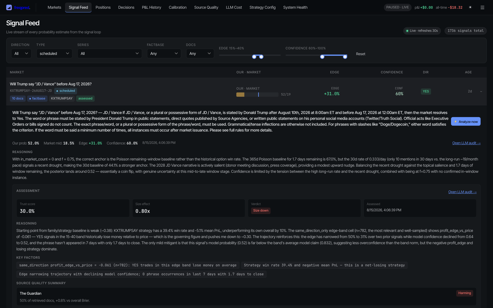
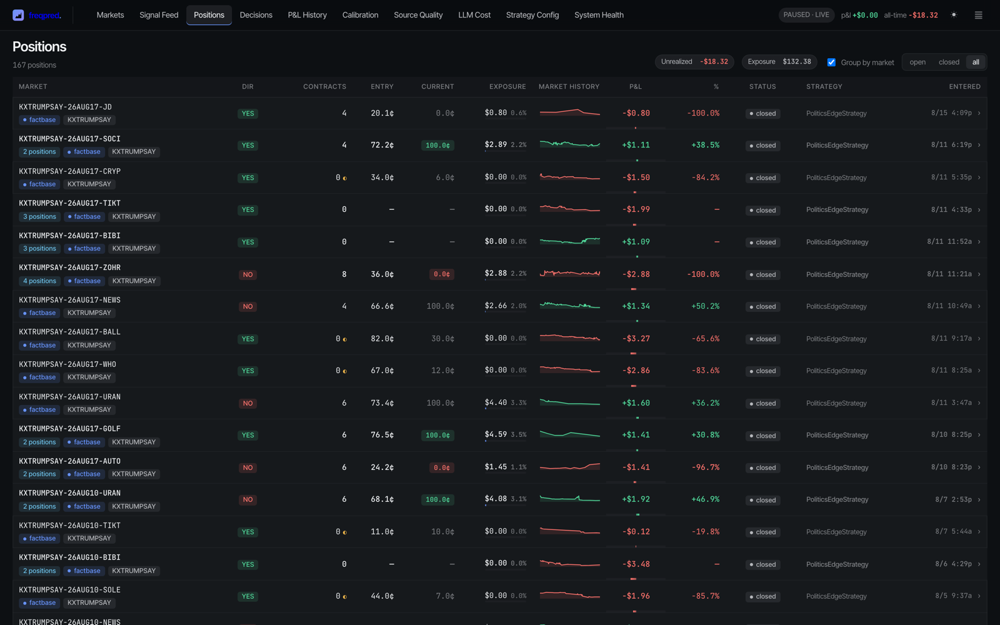
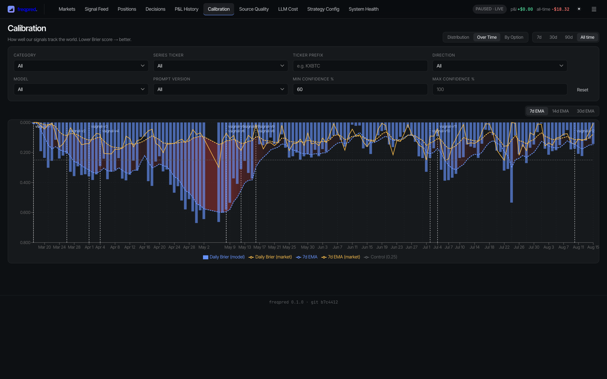
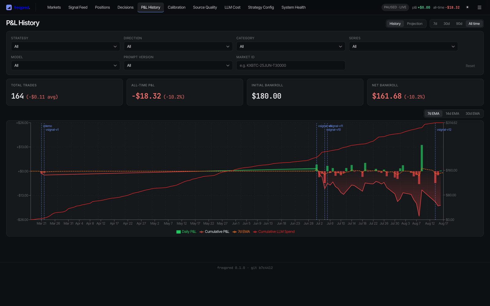
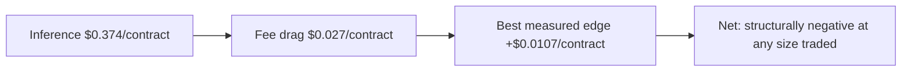
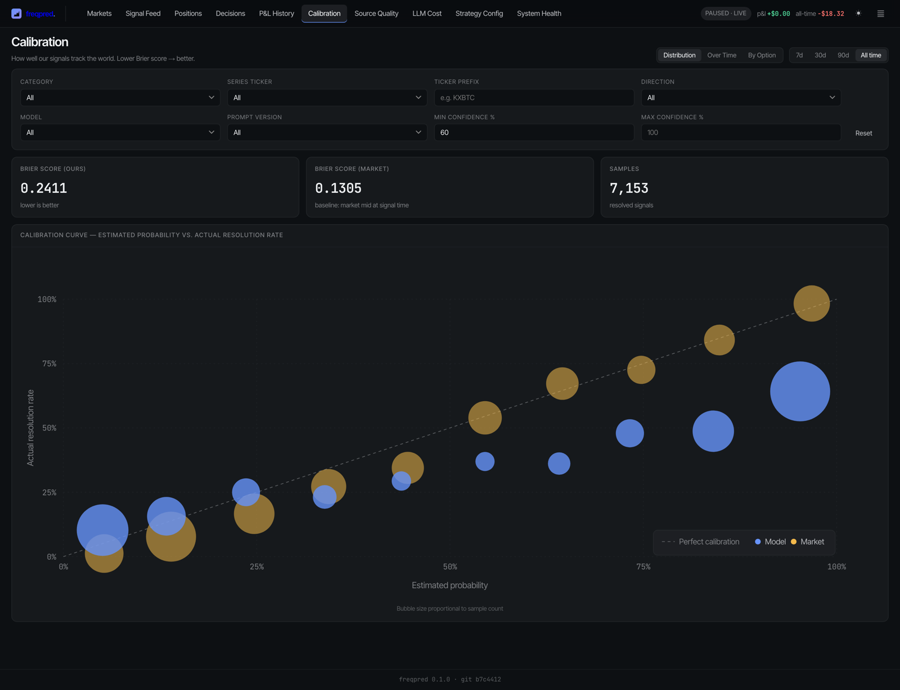
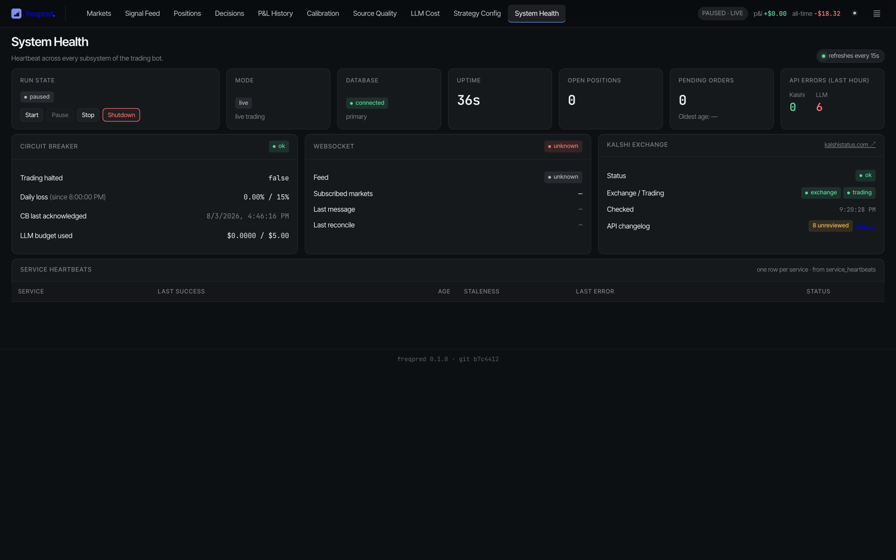

# freqpred — Postmortem

**Status:** Retired
**Active:** 2026-03-15 → 2026-08-18 (5 months)
**Verdict:** Retired on evidence. The core thesis was measured against a free
baseline and lost; independently, the per-signal inference cost exceeded the
best edge ever measured by roughly 35×. Either finding alone is disqualifying.

---

## 1. What was built

| | |
|---|---|
| Commits | 306 |
| Python | 82,461 lines |
| Test files | 80 |
| Alembic migrations | 67 |
| Tracked tasks (T-numbers) | 79 |
| SPEC.md | 2,050 lines |

Subsystems delivered and working: catalyst-driven ingestion across seven sources
(Tavily, NewsAPI, Guardian, Reddit, GDELT, TV archive, Truth Social), a pgvector
document store with hybrid BM25 + semantic retrieval, an LLM signal pipeline with
retrieval-hash gating, an assessment-aware sizing layer, deterministic exits with
candle-based counterfactual scoring, a React dashboard, structured telemetry with
per-service freshness heartbeats, a Kalshi changelog watcher, and a deterministic
weekly profitability review.

None of it was abandoned half-finished. The system ran.

*One signal, fully expanded: model probability vs market mid, the model's
reasoning, the sizing assessor's trust score and verdict, key factors, and
per-source quality attribution. The assessor's verdict on this trade reads
"Strategy win rate 39.4% and negative mean PnL — this is a net-losing
strategy." The instrumentation stayed honest even where the strategy did not
work — see §5.*

## 2. The ledger

### Trading

| | Live | Paper |
|---|---|---|
| Positions | 167 (164 closed) | 561 |
| Net P&L | **−$18.32** | **−$1,044.79** |
| Win rate | 42.1% | 36.0% |
| Avg size | 1.73 contracts | 53.7 contracts |
| Total contracts | 284 | 30,108 |
| P&L per contract | **−$0.0645** | **−$0.0347** |
| Gross deployed | $129.49 | $8,382.51 |
| Fees | $7.70 | — |

Live trading was not continuous. Eight positions in March 2026 (−$2.07) read as
order-plumbing verification; April and May were paper-only; the real live program ran
from June 2026 (18 positions) through July (97) and August (44). Last entry 2026-08-15.
Weekly live P&L across the tracked series: −4.18, +4.43, +0.27, −5.55, +1.47, −8.22.

| Month | Paper positions | Paper P&L | Live positions | Live P&L |
|---|---|---|---|---|
| 2026-03 | 68 | −$70.40 | 8 | −$2.07 |
| 2026-04 | 196 | −$599.83 | — | — |
| 2026-05 | 178 | −$424.10 | — | — |
| 2026-06 | 119 | **+$49.54** | 18 | +$0.57 |
| 2026-07 | — | — | 97 | −$10.08 |
| 2026-08 | — | — | 44 | −$6.74 |

*The closed-position ledger at retirement, 728 rows across paper and live.*

### Inference

**$314.62 across 40,400 calls**, 2026-03-18 → 2026-08-18.

| Query type | Calls | Cost |
|---|---|---|
| `market_analysis` | 11,770 | $180.90 |
| `body_summarization` | 17,612 | $41.78 |
| `signal_assessment` | 1,661 | $40.48 |
| `model_eval` (research) | 1,843 | $36.22 |
| `catalyst_generation` | 4,979 | $8.45 |
| `evidence_extraction` | 1,692 | $5.71 |
| other | 844 | $1.08 |

Volume: 19,924 signals over 1,594 markets; 128,474 documents ingested.

### The ratio that matters

**Inference cost $314.62. Total capital ever deployed live was $129.49.**
The research apparatus cost 2.4× the money it was researching.

## 3. Why it was retired

Two independent kill conditions fired. Neither is addressable by prompt work.

### 3.1 The thesis was falsified

SPEC.md §1: *"LLMs can estimate the 'true' probability of future events by
reasoning over current news and context. Where that estimate diverges
meaningfully from a market's implied probability, there is a tradeable edge."*

The 2026-07-21 review measured exactly this, parsed point-in-time from each
signal's stored prompt (n=61 markets, `in_market_count=0`):

| Estimator | Brier |
|---|---|
| Poisson, 30d rate | **0.2093** |
| Constant base rate | 0.2349 |
| **The model** | **0.2407** |
| Poisson, 365d rate | 0.2517 |

The LLM lost to a Poisson process fit on the same data it was handed, and lost
to a constant. The failure was asymmetric: where it said YES (n=34) it estimated
0.859 against a 52.9% truth — scoring worse than the base rate.

*The same finding measured daily instead of pooled: model Brier (blue bars) vs
market Brier (orange), with all twelve signal-prompt versions marked as vertical
boundaries. Five months of prompt iteration, and the model's EMA never durably
separates from the market's. The red regions — model worse than the price it is
trying to beat — persist to the end.*

Everything downstream — RAG, catalyst generation, question-focused extraction
(T101), the sizing assessor — was refinement on an estimator that never cleared
a free baseline. This is recorded independently in project memory: the signal
LLM's probability adds nothing beyond the market price, and large edge and high
confidence both function as *inverted* quality filters.

### 3.2 The unit economics never closed

Taking the last full week as representative: $13.59 of production inference
produced 21 closed positions.

- **Inference cost:** ~$0.65/position ≈ **$0.374/contract** at 1.73 avg size
- **Fee drag:** ~**$0.027/contract**
- **Best edge ever measured** (pooled NO, 4,189 contracts): **+$0.0107/contract**

The ranking is inference cost > fees > best measured edge, by an order of
magnitude at each step. Even granting the NO edge at face value, covering
inference alone requires **~60 contracts per position** — 35× the size actually
traded.

The paper book *did* run at 53.7 contracts per position. It lost $0.0347 per
contract over 30,108 contracts. The edge did not survive the size that would
have justified the cost.

*Cumulative P&L against cumulative inference spend on one axis. The gap is the
project: −$18.32 realized, $314.62 spent to realize it, bankroll $180.00 →
$161.68.*

## 4. What the data said that the reports kept circling

### The direction split was real, and still not profitable

Pooled across both books (725 positions, 30,392 contracts):

| Direction | P&L/contract | Contracts |
|---|---|---|
| YES | **−$0.0423** | 26,203 |
| NO | **+$0.0107** | 4,189 |

Same sign in paper and live independently (live: NO +$6.07, YES −$24.39; paper:
NO +$38.82, YES −$1,083.61). This is the most robust finding in the dataset.

It was nominated as a strategy change at least twice and never built — no
`directions` field ever existed in `StrategyConfig`. In hindsight that omission
cost nothing: **+$0.0107/contract is below the ~$0.027/contract fee drag.** The
single strongest signal in five months of data was still unprofitable after
costs. Worth stating plainly, because the reports treated it as the live lead
right up to the end.

### The live record is one market series

156 of 164 closed live positions are `KXTRUMPSAY` — 95%. The remaining eight
span four series with 1–3 positions each. Generalization was never tested. Any
statement about "the system's edge" is a statement about one repeated-event
series on one topic.

## 5. What went right

The measurement apparatus was better than the thing it measured, and it is the
part worth keeping.

- **Pre-committed revert triggers.** Every weekly recommendation carried an
  explicit numeric condition for its own retirement, written before the next
  week's data existed. R1 (direction restriction) was retired when its own
  trigger fired. R3's trailing-stop nomination reverted to watchlist exactly as
  specified. Nothing was quietly dropped or quietly kept.
- **Adversarial reading of favorable results.** The 2026-08-04 review noticed
  that a fired trigger was *the wrong test* — raw within-window exit P&L is
  dominated by admitted-signal quality, not exit policy — and replaced it with
  the candle-based counterfactual rather than banking the free win.
- **Refusing both directions of a whipsaw.** When the `signal-v11` vs `v9` gap
  closed after three consecutive significant negative reports, the review
  declined to declare v11 vindicated *and* declined to re-nominate the
  benchmark, naming both readings it could not distinguish.
- **Rewriting rather than patching.** The 2026-07-21 report was rewritten from
  scratch when real candle paths replaced MAE-based counterfactuals, instead of
  accumulating a fifth round of inline corrections. The traps it exposed were
  encoded into the `weekly-review` skill so they could not recur silently.
- **Gates that actually held.** Signal-prompt and assessor changes required
  benchmark validation. When T101 was adopted on mechanism despite a
  non-superior benchmark, that override was recorded *as an override*, with a
  rollout guard date attached.

*The calibration and health surfaces. The apparatus that produced the retirement
decision was better built than the strategy it was measuring — see §8.*

Most builds of this system would have shipped a NO-only filter in week two and
told themselves a story about it. This one didn't.

## 6. What went wrong

### The go/no-go gate was correct, written down, and not enforced

This is the finding that most deserves to outlive the project.

SPEC.md §13 specified, in advance, three criteria for entering Phase 3 (live trading):

1. Brier score below the market's own calibration
2. Positive calibration across all analyzed markets, not just traded ones
3. Positive simulated ROI over 100+ trades

These are the right three tests. Someone thought carefully about what would constitute
evidence and wrote it down before having any. That is better practice than most funded
quant efforts manage.

None of them were met when live trading scaled up in June 2026:

- **Criterion 3 failed decisively.** Cumulative paper at that moment was **−$1,044.79
  over 561 trades**. The only positive month in the entire paper series was June itself
  (+$49.54), the same month the scale-up happened.
- **Criterion 1 was not measured until 2026-07-21** — a month *after* the scale-up — and
  when measured, it failed (§3.1).
- **Criterion 2** was never reported in the form specified.

Whether the decision was consciously made on the trailing month is not recorded. What the
data shows is that the cumulative record failed the stated bar, the trailing month passed
it, and the scale-up followed the trailing month.

The gap between §5 and this section is the central tension of the project: the same
operator who would later honor pre-committed revert triggers week after week, in public,
in writing, walked past a pre-committed entry gate that three months of data had already
failed. Rigor applied downstream of a decision does not substitute for rigor applied to it.

### Sequencing — the load-bearing test ran last

The Brier-vs-Poisson comparison in §3.1 is the experiment the entire project
rested on. It arrived in **month five**. It required no ingestion pipeline, no
vector store, no dashboard, no telemetry, no assessor: a few hundred markets,
one prompt, and a baseline. It was a weekend of work.

It got built last because the ingestion and retrieval work was more tractable,
more legible as progress, and more fun. Five months and 82k lines of
infrastructure were committed before the premise was cheaply checked.

### Sizing made every finding unactionable

At ~1.73 contracts, no result could pay for the analysis that produced it. The
2026-07-21 report said so directly — *"the binding constraint on P&L is stake,
not edge quality — and this review does not measure stake"* — and that stayed
true for the four weekly reviews that followed. Rigorous inference was run on a
book too small for any answer to matter, while inference spend ran 2.4× the
capital at risk.

The instinct behind small size was sound (don't risk real money on an unproven
edge). The error was not recognizing that it converted the entire live program
into an expensive simulation, at which point the paper book was the honest
instrument and the live book was ceremony.

### Effort tracked tractability, not leverage

Ranked by inference spend, the top line is `market_analysis` at $180.90 — the
signal itself, correctly. But $41.78 went to `body_summarization` and $36.22 to
model evaluation research, both in service of improving an estimator whose
falsification was never scheduled. T99–T103 were an evidence-quality sequence:
better retrieval, better extraction, better ranking. All of it was upstream of
a component already known to underperform a constant.

## 7. What would have to be true to restart

Not a roadmap — a bar. Any resumption of this work needs all three:

1. **A probability estimator that beats the Poisson baseline** on a held-out set
   of ≥200 markets, measured before any pipeline is built around it.
2. **Per-position inference cost below 10% of expected edge**, which at any
   plausible edge means either a far cheaper estimator or a far larger stake —
   and the paper book is evidence the edge does not survive the larger stake.
3. **Two or more market series** with independently positive measured edge, so
   the result is not a `KXTRUMPSAY` artifact.

And one process condition, from §6: **the gate must be enforced by something other than
intention.** The bar above is no better than the Phase 3 bar that already existed and was
walked past. If there is a next attempt, the check belongs in code — a refusal to enable
live mode until the criteria are computed and passing — not in a document.

The one genuinely open thread is the inversion: **the Poisson baseline beat the
LLM.** A purely statistical model on repeated-event series, with no LLM in the
loop and therefore near-zero marginal cost per signal, clears condition 2 by
construction and has already outperformed on condition 1's proxy. That is a
different, much smaller project. It is not a reason to keep this one running.

## 8. Assets worth salvaging

- **`freqpred/metrics/weekly_review.py`** and the `weekly-review` skill — the
  counterfactual methodology (candle-based exit sweeps, cluster-bootstrap CIs,
  pre-committed revert triggers, scoring last week's calls before making new
  ones) is domain-independent and is the strongest artifact here.
- **The five weekly reports in `docs/weekly-review/reports/`** — a rare worked
  record of a hypothesis being honestly tracked to its own falsification,
  including the whipsaws and the self-corrections.
- **`freqpred/llm/audit.py`** — total-coverage LLM audit logging. The cost and
  Brier analysis in this document was only possible because every call, including
  failures, wrote a row with its point-in-time prompt.
- **The Kalshi API knowledge** in `CLAUDE.md` — WS v2 channel naming, the
  `determined` vs `settled` distinction, close-time lag characteristics.

## 9. Closing note

The project did not fail by running out of money, attention, or engineering
quality. It failed because it was built to answer a question, it answered it,
and the answer was no.

The instrument that produced that answer worked correctly. Retiring on its
output rather than around it is the system operating as designed.
